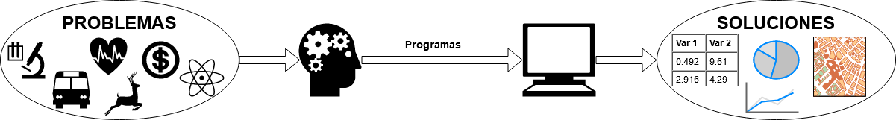
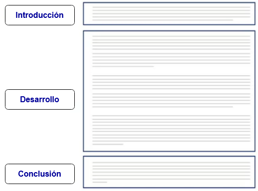
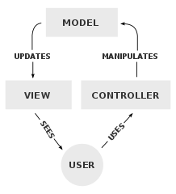
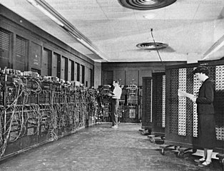

class: title-slide, center, right
background-image: url(img/turing-machine.png)
background-position: center
background-size: 850px

# `r rmarkdown::metadata$title`

.right-column[
`r rmarkdown::metadata$author`<br>
`r rmarkdown::metadata$institute`<br>
`r rmarkdown::metadata$date`
]

.palegrey[.left[.footnote[<small>Representación artística de una [máquina de Turing](https://es.wikipedia.org/wiki/M%C3%A1quina_de_Turing). Fuente: [Porao](https://commons.wikimedia.org/wiki/File:Turing_Machine.png).</small>]]]

---

# Contenidos

- ### Computadoras
  - #### Programas
  - #### Modelo *entrada - procesamiento - salida*
- ### Pensamiento computacional
  - #### Descomposición
  - #### Reconocimiento de patrones
  - #### Abstracción
  - #### Algoritmos
  
---

# Contenidos (continuación)

- ### Arquitectura de computadoras
  - #### Historia
  - #### Máquina de Turing
  - #### Arquitectura de von Neumann
- ### Lenguajes de programación
  - #### Lenguaje máquina
  - #### Lenguajes de alto nivel
  - #### El lenguaje Scratch
  
---
# Computadoras

--
### *"__Máquina electrónica__ que, mediante determinados __programas__, permite almacenar y tratar información, y resolver __problemas de diversa índole__."* ([Diccionario de la lengua española](https://dle.rae.es/computador#A4hIGQC)).

--
### *"__Máquina electrónica digital programable__ que ejecuta una serie de comandos para __procesar__ los datos de __entrada__, obteniendo convenientemente información que posteriormente se envía a las unidades de __salida__."* ([Wikipedia](https://es.wikipedia.org/wiki/Computadora)).

--
### *"A computer is a __machine or device__ that performs processes, calculations and operations based on instructions provided by a software or hardware __program__. It has the ability to accept data (__input__), __process__ it, and then produce __outputs__."* ([Techopedia](https://www.techopedia.com/definition/4607/computer)).

---

# Características de las computadoras

--
### Son **programables**: su funcionamiento puede modificarse sin alterar sus componentes físicos, especificando secuencias de instrucciones (ej. cálculos, operaciones lógicas) que se ejecutan automáticamente.

--
### Estas secuencias de instrucciones son denominadas **programas**.

--
### Los programas trabajan con un modelo de **entrada - procesamiento - salida**:
- #### Reciben datos de **entrada** (ej. de archivos, de un teclado).
- #### Los **procesan** (ej. mediante cálculos matemáticos).
- #### Generan **salidas** (ej. resultados de los cálculos).

---

# Modelo entrada -> procesamiento -> salida

--
Este patrón describe el flujo de trabajo básico de cualquier algoritmo o programa.

<br><br>
<figure>
  
</figure>

---

# Ejemplo de modelo entrada - procesamiento - salida

--
### El [índice de masa corporal (IMC)](https://es.wikipedia.org/wiki/%C3%8Dndice_de_masa_corporal) clasifica el peso de las personas en categorías como bajo, normal y sobrepeso, con base en su masa y estatura.

--
- ### Entradas: $masa$ (kg), $estatura$ (m)
- ### Procesamiento: $imc = masa/estatura^2$
- ### Salida: $imc$


--
### **Ejercicio**: Calcule manualmente su IMC y verifique el resultado con esta [calculadora](https://www.nhlbi.nih.gov/health/educational/lose_wt/BMI/bmi-m_sp.htm).

---

# ¿Por qué utilizamos computadoras?

--
### Nos ayudan a resolver problemas.

--


--
### La forma de solucionar un problema debe expresarse de forma tal que pueda ser implementada en una computadora: mediante programación.

---
# Ejemplos de problemas que pueden resolverse con ayuda de computadoras

### - Numéricos
### - Criptográficos
### - Científicos
### - Financieros
### - Geoespaciales

---
# Problemas geoespaciales - ejemplo

--
<figure>
  
</figure>

--
<figcaption>
  <small><a href="https://www.theguardian.com/news/datablog/2013/mar/15/john-snow-cholera-map">Mapa de John Snow</a> que muestra los casos de cólera durante la <a href="https://es.wikipedia.org/wiki/Epidemia_de_c%C3%B3lera_de_Broad_Street">epidemia de Broad Street</a>, Londres, en 1854.  Puede apreciarse la cercanía de muchos casos a la bomba de agua contaminada en la intersección de Broad Street y Cambridge Street. Fuente: <a href="https://en.wikipedia.org/wiki/File:Snow-cholera-map-1.jpg">John Snow</a>.</small>
</figcaption> 

---
# Otros ejemplos de problemas geoespaciales

- ### ¿Cuáles son las zonas prioritarias para la conservación de una especie?
- ### ¿Cuál es la mejor ubicación para un local comercial?
- ### ¿Cuáles son las áreas más vulnerables a desastres naturales?
- ### ¿Cuáles son los lugares en los que una epidemia tiene más probabilidades de impactar?
- ### ¿Cuál es la ruta más corta entre dos sitios?

---

# Pensamiento computacional

--
- ### Es un enfoque para la resolución de problemas basado en conceptos y métodos de las ciencias de la computación.

--
- ### Puede ser aplicado en muchas áreas, no solo en computación.

--
- ### Se considera una de las destrezas fundamentales del siglo XXI.

--
- ### Investigación en pensamiento computacional:
  - #### [Papert, 1996](http://www.papert.org/articles/AnExplorationintheSpaceofMathematicsEducations.html)
  - #### [Wing, 2006](https://www.cs.cmu.edu/~15110-s13/Wing06-ct.pdf)

---

# Conceptos fundamentales del pensamiento computacional

--
- ### **Descomposición**: división de un problema en subproblemas más pequeños.

--
- ### **Reconocimiento de patrones**: búsqueda de similitudes de un problema a resolver, con problemas ya resueltos.

--
- ### **Abstracción**: identificación de la información que se necesita y filtrado de la que no se necesita para resolver un problema.

--
- ### **Algoritmos**: descripción, paso por paso, de la solución a un problema.

---

# Descomposición - ejemplo
## Escritura de un documento

--
.pull-left[
### Documento sin secciones
<figure>
  
  <figcaption>
    <small>Fuente: <a href="https://www.coursera.org/learn/computational-thinking-problem-solving">Universidad de Pennsylvania</a>.</small>
  </figcaption>
</figure>
]

--
.pull-right[
### Documento con secciones
<figure>
  
  <figcaption>
    <small>Fuente: <a href="https://www.coursera.org/learn/computational-thinking-problem-solving">Universidad de Pennsylvania</a>.</small>
  </figcaption>
</figure>
]

---

# Reconocimiento de patrones - ejemplo
## Patrones de diseño de software

--
.pull-left[
- "*Cada patrón describe un problema que ocurre infinidad de veces en nuestro entorno, así como la solución al mismo, de tal modo que podemos utilizar esta solución un millón de veces más adelante sin tener que volver a pensarla otra vez.*" ([Christopher Alexander, 1977](https://laptrinhx.com/a-pattern-language-3372046788/))

- Los patrones de diseño de software alcanzaron gran popularidad con la publicación del libro [*Design Patterns: Elements of Reusable Object-Oriented Software* (1994)](https://en.wikipedia.org/wiki/Design_Patterns), en el cual se documentan [23 patrones de diseño de software](https://en.wikipedia.org/wiki/Design_Patterns#Patterns_by_type).
]

--
.pull-right[
<figure>
  
  <figcaption>
    <small>Diagrama de interacciones en el patrón de diseño de software denominado <a href="https://es.wikipedia.org/wiki/Modelo%E2%80%93vista%E2%80%93controlador">Modelo-Vista-Controlador o <em>Model-View-Controller</em> (MVC)</a>. Fuente: <a href="https://commons.wikimedia.org/wiki/File:MVC-Process.svg">RegisFrey</a>.</small>
  </figcaption>
</figure>
]

---

# Reconocimiento de patrones - ejemplo
## *Idioms* de programación

--
.pull-left[
### Los [*idioms* de programación](https://en.wikipedia.org/wiki/Programming_idiom) son fragmentos de programas que se utilizan frecuentemente. Pueden utilizarse para introducir buenas prácticas de programación.
]

--
.pull-right[
### Ejemplos:

- #### Recorrer una lista.
- #### Insertar un elemento en una lista.
- #### Buscar un elemento en una lista.
- #### Abrir un archivo.
- #### Recorrer un archivo.
]
---

# Abstracción - ejemplo
## Selección de atributos de un conjunto de datos

--
.pull-left[
### Atributos generales de una persona
- Nombre
- Edad
- Ingreso mensual
- Historial académico
- Pasatiempos
- Color favorito
- Estatura
- Peso
- Historial médico
- ...
]

--
.pull-right[
#### Atributos a considerar para la BD de una universidad
- Nombre
- Edad
- Historial académico
- ...

#### Atributos a considerar para la BD de una red social
- Nombre
- Edad
- Pasatiempos
- ...
]

---

# Algoritmos

--
- ### Indicaciones detalladas de como resolver, paso por paso, un problema.

--
- ### Especifican el orden en el que deben ejecutarse los pasos, así como las condiciones que deben cumplirse antes de cada paso.

---

# Algoritmos - ejemplo
## Receta de cocina - [Arroz con pollo](https://www.recetascostarica.com/recetas/plato-principal/arroz-con-pollo-costarricense)

--
<figure>
  
  <figcaption>
    <small>Fuente: <a href="https://cookpad.com/cr/recetas/6014919-arroz-con-pollo-al-estilo-costarricense">Cookpad</a>.</small>
  </figcaption>
</figure>

---

# Algoritmos - ejemplo
## Obtener el valor máximo de una lista

--
#### lista = [29.6, -36.81, 31.85, 25.71, 90.2, 0.4]

--
Solo es posible comparar dos elementos de la lista a la vez, para determinar si uno es mayor, menor o igual que otro.

--
#### Algoritmo

--
1. Se lee la lista (del teclado, de un archivo o de alguna otra fuente).

--
2. Si la lista está vacía, se despliega la hilera de texto "Lista vacía" y se concluye el proceso. Si no, se continúa con el paso 3.

--
3. Se designa el primer elemento de la lista como "máximo actual".

--
4. Se recorre la lista y se compara cada uno de los elementos con el máximo actual.

--
5. Si un elemento comparado es mayor que el máximo actual, entonces pasa a ser el nuevo máximo actual.

--
4. El valor máximo de la lista es el máximo actual, cuando termina de recorrerse la lista.

---

# Algoritmos - ejemplo
## Obtener el valor máximo de una lista (continuación)

--
### Ejecución del algoritmo

--
<span style="color:green";>elemento en verde = máximo actual</span>  
<span style="color:red";>elemento en rojo  = elemento que está siendo comparado</span>
<p>

--
[<span style="color:green;">29.6</span>, <span style="color:red;">-36.81</span>, 31.85, 25.71, 90.2, 0.4]  
<p>

--
[<span style="color:green;">29.6</span>, -36.81, <span style="color:red;">31.85</span>, 25.71, 90.2, 0.4]  
<p>

--
[29.6, -36.81, <span style="color:green;">31.85</span>, <span style="color:red;">25.71</span>, 90.2, 0.4]  
<p>

--
[29.6, -36.81, <span style="color:green;">31.85</span>, 25.71, <span style="color:red;">90.2</span>, 0.4]  
<p>

--
[29.6, -36.81, 31.85, 25.71, <span style="color:green;">90.2</span>, <span style="color:red;">0.4</span>]  
<p>

--
[29.6, -36.81, 31.85, 25.71, <span style="color:green;">90.2</span>, 0.4]  
<p>

--
### Valor máximo = <span style="color:green;">90.2</span>

---

# Algoritmos - diagramas de flujo

--
.pull-left[
- ### Los [diagramas de flujo](https://es.wikipedia.org/wiki/Diagrama_de_flujo) son representaciones diagramáticas de un algoritmo.
- ### Representan los pasos del algoritmo mediante [símbolos](https://es.wikipedia.org/wiki/Diagrama_de_flujo#Simbolog%C3%ADa_y_significado) y su orden de ejecución mediante flechas.
- ### Por convención, se leen de arriba hacia abajo o de izquierda a derecha.
]

--
.pull-right[
#### Ejemplo: obtener el máximo de una lista
<figure>
  
</figure>
]

---

# Algoritmos - pseudocódigo

--
.pull-left[
- ### El [pseudocódigo](https://es.wikipedia.org/wiki/Pseudoc%C3%B3digo) es una descripción textual y en lenguaje natural de un algoritmo.
- ### Su estructura se asemeja a la de un lenguaje de programación, pero está diseñado para que ser comprendido por personas, no para ser ejecutado por computadoras.
]

--
.pull-right[
#### Ejemplo: obtener el máximo de una lista
```r
LISTA <- Leer()
si (Vacia(LISTA)) {
  Desplegar("Lista vacía")
} si no {
  MAX <- LISTA[1]
  I <- 1
  mientras (I <= Longitud(LISTA)) {
    ITEM <- LISTA[I]
    si (ITEM > MAX) {
      MAX <- ITEM
    }
    I <- I + 1
  }
  Desplegar(MAX)
}
```
]

---

# Algoritmos - implementación en [R](https://www.r-project.org/)

```r
# Programa para obtener el valor máximo de una lista

# Entrada
lista <- c(29.6, -36.81, 31.85, 25.71, 90.2, 0.4)
cat("Lista de entrada: ", lista, "\n")

# Procesamiento
if (length(lista) == 0) {
  cat("La lista está vacía", "\n")
} else {
  max <- lista[1]
  i <- 1
  while (i <= length(lista)) {
    if (lista[i] > max) {
      max <- lista[i]
    }
    i <- i + 1
  }
  
  # Salida
  cat("Valor máximo de la lista: ", max, "\n")
}
```

---

# Algoritmos - implementación en [Python](https://www.python.org/)

```python
# Programa para obtener el valor máximo de una lista

# Entrada
lista = [29.6, -36.81, 31.85, 25.71, 90.2, 0.4]
print("Lista de entrada: ", lista)

# Procesamiento
if (len(lista) == 0):
    print("La lista está vacía")
else:
    max = lista[0]
    i = 0
    while (i < len(lista)):
        if (lista[i] > max):
            max = lista[i]
        i = i + 1
        
    # Salida
    print("Valor máximo de la lista:", max)  
```

---

# Ejercicios

- ## Ejecute los programas anteriores en una [consola de R](https://www.mycompiler.io/new/r) y en una [consola de Python](https://www.mycompiler.io/new/python), según corresponda. Cambie los datos de entrada y observe los resultados.
- ## En la consola de R, escriba un pequeño programa que calcule el índice de masa corporal. Siga el modelo de entrada - procesamiento - salida.

---

# Arquitectura de computadoras

.pull-left[
- Las computadoras modernas están construídas con base en [circuitos integrados (CI)](https://es.wikipedia.org/wiki/Circuito_integrado), también llamados *chips* o *microchips*.

- Los CI procesan [información digital](https://es.wikipedia.org/wiki/Se%C3%B1al_digital) (que usa valores discretos), la cual generalmente es binaria (i.e. de dos valores).

- Los CI de una computadora procesan dos estados correspondientes a **dos niveles de tensión eléctrica: alto y bajo**. Estos estados se representan con **0 y 1**. Esto facilita la aplicación de la [lógica binaria](https://es.wikipedia.org/wiki/L%C3%B3gica_binaria) y de la [aritmética binaria](https://es.wikipedia.org/wiki/Sistema_binario).
]

.pull-right[
<figure>
  
  <figcaption>
    <small>
      Imagen de <a href="https://unsplash.com/@slavudin?utm_source=unsplash&utm_medium=referral&utm_content=creditCopyText">Slejven Djurakovic</a> disponible en <a href="https://unsplash.com/s/photos/chip?utm_source=unsplash&utm_medium=referral&utm_content=creditCopyText">Unsplash</a>.
    </small>
  </figcaption>
</figure>

<figure>
  
  <figcaption>
    <small>
      Imagen de <a href="https://unsplash.com/@yasin?utm_source=unsplash&utm_medium=referral&utm_content=creditCopyText">Yasin Hasan</a> disponible en <a href="https://unsplash.com/s/photos/alarm-clock-digital?utm_source=unsplash&utm_medium=referral&utm_content=creditCopyText">Unsplash</a>.
    </small>
  </figcaption>
</figure>
]

---

# Historia de la computadora

--
### Durante el siglo XVII, varios matemáticos construyeron [calculadoras mecánicas](https://es.wikipedia.org/wiki/Pascalina) capaces de sumar, restar, multiplicar y dividir.

--
### En la primera mitad del siglo XIX, **Charles Babbage** diseñó la [máquina analítica](https://es.wikipedia.org/wiki/M%C3%A1quina_anal%C3%ADtica), considerada la primera computadora programable.

--
### A mediados del siglo XIX, **George Boole** introdujo el [álgebra booleana](https://es.wikipedia.org/wiki/%C3%81lgebra_de_Boole), la cual trata sobre las operaciones (ej. AND, OR, NOT) en valores lógicos (verdaderos o falsos).

--
### En la primera mitad del XX, **Claude Shannon** demostró como el álgebra booleana podía ser aplicada al diseño de [circuitos digitales](https://es.wikipedia.org/wiki/Circuito_digital).

---

# La máquina de Turing

--
- ### Durante el período entre las guerras mundiales, **Allan Turing** desarrolló la [máquina de Turing](https://es.wikipedia.org/wiki/M%C3%A1quina_de_Turing), un dispositivo teórico que manipula símbolos de una cinta de acuerdo con una tabla de reglas.

--
- ### La máquina de Turing simula el funcionamiento de un algoritmo y los conceptos de **entrada, procesamiento y salida**.

--
- ### La mayoría de las computadoras modernas están basadas en el concepto de la máquina de Turing.

---

# Representación artística de la máquina de Turing

--
<figure>
  
  <figcaption>
    <small>
      Representación artística de una máquina de Turing. Imagen de <a href="https://commons.wikimedia.org/wiki/File:Turing_Machine.png">Porao en Wikimedia</a>.
    </small>
  </figcaption>
</figure>

---

# Primeras computadoras electrónicas

--
- ### Con base en las ideas de Turing, las computadoras [Bombe](https://es.wikipedia.org/wiki/Bombe) y  [Colossus](https://es.wikipedia.org/wiki/Colossus) fueron construídas durante la II Guerra Mundial (1939 - 1945) en el Reino Unido para descifrar mensajes codificados. A pesar de que se consideran de las primeras computadoras digitales electrónicas programables, su programación se realizaba a través de componentes de *hardware*, como interruptores y enchufes, y no con un [programa almacenado](https://es.wikipedia.org/wiki/Computador_de_programa_almacenado).

--
- ### También durante la II Guerra Mundial, el ejército de Estados Unidos de América construyó [ENIAC (Electronic Numerical Integrator and Computer)](https://es.wikipedia.org/wiki/ENIAC) para calcular tablas de tiro de artillería. Es considerada por algunos como la primera computadora programable digital de propósito general. Era capaz de seguir el modelo de la máquina de Turing, por lo que era [Turing-completa](https://es.wikipedia.org/wiki/Turing_completo). 

---

# Primeras computadoras electrónicas

.pull-left[
<figure>
  
  <figcaption>
    <small>
      Computador Colossus operado por integrantes del <em>Women's Royal Naval Service (WRNS)</em>. Imagen de <a href="https://commons.wikimedia.org/wiki/File:Colossus.jpg">autor desconocido en Wikimedia</a>.
    </small>
  </figcaption>
</figure>
]

.pull-righ[
<figure>
  
  <figcaption>
    <small>
      ENIAC programado por Glen Beck y Betty Snyder. Imagen del <a href="https://commons.wikimedia.org/wiki/File:Eniac.jpg">Ejército de Estados Unidos en Wikimedia</a>.
    </small>
  </figcaption>
</figure>
]

---

# La arquitectura de von Neumann

--
- ### En 1945, **John von Neumann** propuso un concepto conocido como **programa almacenado**, en el cual los datos y los programas se almacenan en una estructura llamada **memoria**, separada del hardware que ejecuta las instrucciones.

--
- ### Este modelo permite que las computadoras sean más fáciles de reprogramar y es conocido actualmente como [arquitectura de von Neumann](https://es.wikipedia.org/wiki/Arquitectura_de_Von_Neumann).

---

# Diagrama de la arquitectura de von Neumann

--
<figure>
  
  <figcaption>
    <small>
      Diagrama de la arquitectura de von Neumann. Imagen de <a href="https://commons.wikimedia.org/wiki/File:Arquitecturaneumann.jpg">David Strigoi en Wikimedia</a>.
    </small>
  </figcaption>
</figure>

---

# Componentes de la arquitectura de von Neumann
## Memoria principal

--
- ### Almacena las instrucciones de los programas y los datos que utilizan estos programas.

--
- ### Es común denominarla como RAM (*Random Access Memory*, Memoria de Acceso Aleatorio), lo que significa que toma el mismo tiempo acceder a cualquier posición de la memoria.

--
- ### Cada posición de memoria tiene una dirección a la que se hace referencia cuando se desea leer o escribir.

---

# Componentes de la arquitectura de von Neumann
## Unidad central de procesamiento

--
- ### La Unidad Central de Procesamiento o CPU (*Central Processing Unit*) se encarga de ejecutar las instrucciones de los programas.

--
- ### Está compuesta por dos partes:
  - #### La Unidad de Control: determina cuál es la siguiente instrucción a ejecutar. Contiene memorias temporales de alta velocidad y poca capacidad llamadas registros, para almacenar los operandos y el resultado de las instrucciones.
  - #### La Unidad de Aritmética y Lógica o ALU (*Arithmetic and Logic Unit*): ejecuta las operaciones aritméticas y lógicas.
  
---

# Componentes de la arquitectura de von Neumann
## Sistemas de entrada y salida

--
- ### Permiten que la computadora interactúe con el usuario y, en general, con el mundo exterior.

--
- ### Algunos ejemplos son el teclado y el ratón, como sistemas de entrada, y la pantalla y la impresora, como sistemas de salida.

---

# Código binario

--
- ### Los CI de las computadoras usan voltajes bajos y altos para representar dos posibles valores de información: 0 y 1. Este es un sistema binario y cada dígito binario (0 o 1) se denomina *bit* (*binary digit*).

--
- ### Los bits se agrupan (por ejemplo, en [bytes = 8 bits](https://es.wikipedia.org/wiki/Byte)) para representar elementos de información más complejos, como números más grandes o carácteres de texto. Por ejemplo:
  - El número decimal ```14``` se representa en binario como ```1110```:  
```1110``` = ```2^3*1 + 2^2*1 + 2^1*1 + 2^0*0``` = ```8 + 4 + 2 + 0``` = ```14```
  - La palabra ```bit``` se representa en [código ASCII](https://es.wikipedia.org/wiki/ASCII) como:  
```01100010 01101001 01110100``` = ```bit```

---

# Lenguaje máquina

--
- ### El [lenguaje máquina](https://es.wikipedia.org/wiki/Lenguaje_de_m%C3%A1quina) es un conjunto de instrucciones binarias interpretables por un CPU. Las instrucciones representan acciones a ser ejecutadas por la computadora. Cada CPU tiene su propio lenguaje máquina. 

--
- ### Un programa consiste de una secuencia de instrucciones en lenguaje máquina.

--
- ### Por ejemplo, la siguiente instrucción suma los contenidos de los registros 1 y 2 y almacena el resultado en el registro 6 de un CPU:

<figure>
  
  <figcaption>
    <small>
      Instrucción de suma en lenguaje máquina. Fuente <a href="https://en.wikipedia.org/wiki/Machine_code">Machine code - Wikipedia</a>.
    </small>
  </figcaption>
</figure>

---

# Lenguajes de programación

--
- ### Debido a que programar una computadora en lenguaje máquina es excesivamente lento y complicado, en la década de 1950 comenzaron a crearse lenguajes de programación que, en lugar de unos y ceros, consisten de instrucciones formadas por palabras, usualmente en idioma inglés. Por ejemplo, el siguiente programa en lenguaje [C](https://www.iso.org/standard/74528.html) imprime la hilera de texto ["hello, world\n"](http://helloworldcollection.de/):

<figure>
  
</figure>

--
- ### Existe una gran [variedad de lenguajes de programación](https://en.wikipedia.org/wiki/List_of_programming_languages) que han sido creados con diversos fines: científicos, comerciales, educacionales, etc.

---

# El lenguaje de programación Scratch

.pull-left[
- [Scratch](https://scratch.mit.edu/) es un lenguaje de programación orientado a educación. Su nombre proviene de la palabra [*scratching*](https://en.wikipedia.org/wiki/Scratching).

- [*"Scratch ayuda a las personas jóvenes a pensar creativamente, razonar sistemáticamente y trabajar colaborativamente..."*](https://scratch.mit.edu/about).

- Fue desarrollado en 2003 (una versión de escritorio) por el [MIT Media Lab](https://www.media.mit.edu/) y es administrado por la Fundación Scratch, una organización sin fines de lucro que lo facilita de manera gratuita.

- Scratch es software libre distribuido mediante licencia [GPLv2](https://es.wikipedia.org/wiki/GNU_General_Public_License).
]

.pull-right[
<figure>
  
  <figcaption>
    <small>Fuente: <a href="https://commons.wikimedia.org/wiki/File:Scratchlogo.svg">Scratch Team</a>.</small>
  </figcaption>
</figure>
]

---

# Práctica de programación con Scratch
## Considere este paisaje:


---

# Práctica de programación con Scratch

- Ingrese al sitio web de [Scratch](https://scratch.mit.edu/) y estudie la intefaz del ambiente de desarrollo. Puede buscar información adicional en otros sitios (Google, YouTube, etc.). Revise ejemplos y proyectos de otras personas para saber qué puede hacer con Scratch.

- Utilizando los cuatro principios fundamentales del pensamiento computacional, desarrolle un algoritmo para dibujar el paisaje de la diapositiva anterior. Considere las siguientes preguntas orientadoras:

  - ¿Cómo puede dividirse el problema?
  - ¿Qué patrones observa (formas, tamaños, etc.)?
  - ¿Qué información se necesita para hacer los dibujos (ej. medidas)?
  - ¿Qué nivel de detalle requiere el algoritmo?
  
- Implemente en Scratch el algoritmo que desarrolló.

---
exclude: false

# Algunas sugerencias

- ### Procure que el código fuente de sus programas sea ordenado y legible.
- ### Reutilice el código fuente mediante bloques, funciones y otros mecanismos.
- ### Use identificadores (ej. nombres de variables, nombres de bloques o funciones) significativos.
- ### Incluya comentarios en el código fuente de sus programas y también escriba documentación externa.

---
exclude: false

# Práctica de programación con Scratch
## Aplicación de pensamiento computacional

### Descomposición
**Subproblemas**
- Dibujar casa
  - Dibujar base
  - Dibujar techo
  
- Dibujar edificio
  - Dibujar base
  - Dibujar base
  - Dibujar techo

---
exclude: false

# Práctica de programación con Scratch
## Aplicación de pensamiento computacional

### Reconocimiento de patrones

**Patrones identificados:**
- #### Dibujar base <--> dibujar cuadradado (cuatro lados iguales y cuatro ángulos iguales de 90°)
- #### Dibujar techo <--> dibujar triángulo equilátero (tres lados iguales y tres ángulos iguales de 60°)

---
exclude: false

# Práctica de programación con Scratch
## Aplicación de pensamiento computacional

### Abstracción

**Atributos necesarios para dibujar las figuras:**
- #### Coordenada x
- #### Coordenada y
- #### Longitud del lado (de cuadrados y triángulos)

---
exclude: true

# Práctica de programación con Scratch
## Aplicación de pensamiento computacional

### Algoritmo en pseudocódigo
Nota: las posiciones (x, y) que se pasan como parámetros corresponden a la esquina inferior izquierda de las figuras.


<pre><code class="shell">
dibujar_paisaje
  borrar_todo
  dibujar_casa (-160, 10, 50)
  dibujar_casa (-85, -140, 60)
  dibujar_casa (145, -60, 75)
  dibujar_edificio (10, -40, 75)  
</code></pre>

---
exclude: true

<pre><code class="shell">
dibujar_casa (x, y, lado)
  dibujar_base (x, y, lado)
  dibujar_techo (x, y + lado, lado)

dibujar_edificio (x, y, lado)
  dibujar_base (x, y, lado)
  dibujar_base (x, y + lado, lado)
  dibujar_techo (x, y + lado*2, lado)
  
dibujar_base (x, y, lado)
  subir_lapiz
  ir_a (x, y)
  apuntar_en_direccion (90)
  bajar_lapiz
  repetir 4 veces
    esperar_segundos (0.5)
    mover (lado)
    girar_derecha (90)
    
dibujar_techo (x, y, lado)
  subir_lapiz
  ir_a (x, y)
  bajar_lapiz
  apuntar_en_direccion (90)
  repetir 3 veces
    esperar_segundos (0.5)
    mover (lado)
    girar_izquierda (120)
</code></pre>

---
exclude: true

# Práctica de programación con Scratch
## Aplicación de pensamiento computacional

### Resultado de la implementación del algoritmo en Scratch


[Código fuente](paisaje/paisaje.sb3)

